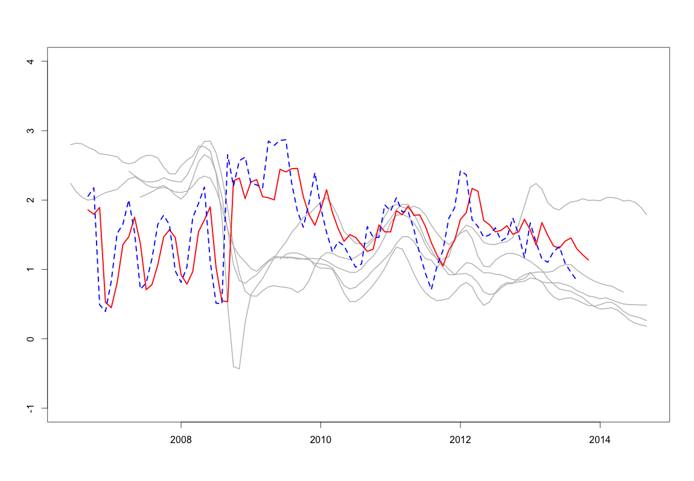

##  **MTS_comexpinf**


```yaml
Name of QuantLet : MTS_comexpinf

Published in : MTS

Description : 'Produces the estimation results derived from the 
joint modeling of IE dynamics. Graphic showing the common inflation 
factor and the model residuals.'

Keywords : 'Kalman filter, MLE, estimation, filter, maximum-likelihood, 
optimization, similarity'

See also : 'MTS_afns_de, MTS_afns_fr, MTS_afns_it, MTS_afns_sw, MTS_afns_uk, 
MTS_comexpinf_cds, MTS_expinf'

Author : Shi Chen

Submitted :

Datafile : 'expinf.RData'

Example :
- 'Common inflation factor estimated by the joint modeling of IE dynamics.'
- 'Model residuals for modeling of IE dynamics over different countries.'

```




```R
## clear history
rm(list = ls(all = TRUE))
graphics.off()

## install and load packages
libraries = c("zoo", "FKF", "expm", "Matrix", "formatR")
lapply(libraries, function(x) if (!(x %in% installed.packages())) {
  install.packages(x)
})
lapply(libraries, library, quietly = TRUE, character.only = TRUE)
setwd("C:/Users/chenshic.hub/Dropbox/Panel_NS_AF/Code/MTS_Qcodes/")

## load dataset
load("expinf.RData")
uk.epi = expinf[, 1]
fr.epi = expinf[, 2]
sw.epi = expinf[, 3]
it.epi = expinf[, 4]
de.epi = expinf[, 5]
ukts2 = ts(uk.epi, frequency = 12, start = c(2006, 6))
dets2 = ts(de.epi, frequency = 12, start = c(2009, 6))
frts2 = ts(fr.epi, frequency = 12, start = c(2006, 6))
itts2 = ts(it.epi, frequency = 12, start = c(2007, 6))
swts2 = ts(sw.epi, frequency = 12, start = c(2007, 4))

## the time period contains all five countries
ukepi = uk.epi[39:100]
frepi = fr.epi[39:100]
swepi = sw.epi[25:86]
itepi = it.epi[27:88]
deepi = de.epi[1:62]
y51 = matrix(c(ukepi, frepi, itepi, swepi, deepi), nr = 5)

jointmodel = function(q1, b1, b2, b3, b4, b5, a1, a2, a3, a4, a5, p1) {
  Tt = matrix(c(q1), 1, 1)
  Zt = rbind(b1, b2, b3, b4, b5)
  ct = rbind(a1, a2, a3, a4, a5)
  dt = matrix(c(p1), 1, 1)
  GGt = matrix(0.1 * diag(5), 5, 5)
  HHt = matrix(0.1 * diag(1), 1, 1)
  a0 = mean(y51[, 1])
  P0 = HHt * 10
  return(list(a0 = a0, P0 = P0, ct = ct, dt = dt, Zt = Zt, Tt = Tt, GGt = GGt, 
              HHt = HHt))
}

objective = function(theta, yt) {
  sp = jointmodel(theta["q1"], theta["b1"], theta["b2"], theta["b3"], 
                  theta["b4"], theta["b5"], theta["a1"], theta["a2"], theta["a3"], 
                  theta["a4"], theta["a5"], theta["p1"])
  ans = fkf(a0 = sp$a0, P0 = sp$P0, dt = sp$dt, ct = sp$ct, Tt = sp$Tt, 
            Zt = sp$Zt, HHt = sp$HHt, GGt = sp$GGt, yt = yt)
  return(-ans$logLik)
}

theta = c(q1 = c(0.2), b = c(0.5, 0.5, 0.5, 0.5, 0.5), 
          a = c(0.3, 0.3, 0.3, 0.3, 0.3), p1 = c(0.8))

fit = optim(theta, objective, yt = y51, hessian = TRUE)
sp = jointmodel(fit$par["q1"], fit$par["b1"], fit$par["b2"], fit$par["b3"], 
                fit$par["b4"], fit$par["b5"], fit$par["a1"], fit$par["a2"], 
                fit$par["a3"], fit$par["a4"], fit$par["a5"], fit$par["p1"])
ans = fkf(a0 = sp$a0, P0 = sp$P0, dt = sp$dt, ct = sp$ct, Tt = sp$Tt, Zt = sp$Zt, 
          HHt = sp$HHt, GGt = sp$GGt, yt = y51)

comexp0914 = c(ans$at[-1])
comexp0914filter = c(ans$att[-1])
commonfit0915 = fit
commonans0915 = ans

## the period contains four countries
ukepi = uk.epi[15:39]
frepi = fr.epi[15:39]
swepi = sw.epi[5:29]
itepi = it.epi[3:27]
y51 = matrix(c(ukepi, frepi, itepi, swepi), nr = 4)
jointmodel = function(q1, b1, b2, b3, b4, a1, a2, a3, a4, p1) {
  Tt = matrix(c(q1), 1, 1)
  Zt = rbind(b1, b2, b3, b4)
  ct = rbind(a1, a2, a3, a4)
  dt = matrix(c(p1), 1, 1)
  GGt = matrix(0.1 * diag(4), 4, 4)
  HHt = matrix(0.1 * diag(1), 1, 1)
  a0 = mean(y51[, 1])
  P0 = HHt * 10
  return(list(a0 = a0, P0 = P0, ct = ct, dt = dt, Zt = Zt, Tt = Tt, GGt = GGt, 
              HHt = HHt))
}

objective = function(theta, yt) {
  sp = jointmodel(theta["q1"], theta["b1"], theta["b2"], theta["b3"], theta["b4"], 
                  theta["a1"], theta["a2"], theta["a3"], theta["a4"], theta["p1"])
  ans = fkf(a0 = sp$a0, P0 = sp$P0, dt = sp$dt, ct = sp$ct, Tt = sp$Tt, 
            Zt = sp$Zt, HHt = sp$HHt, GGt = sp$GGt, yt = yt)
  return(-ans$logLik)
}

theta = c(q1 = c(0.2), b = c(0.2, 0.2, 0.2, 0.2), 
          a = c(0.3, 0.3, 0.3, 0.3), p1 = c(0.8))
fit = optim(theta, objective, yt = y51, hessian = TRUE)
sp = jointmodel(fit$par["q1"], fit$par["b1"], fit$par["b2"], fit$par["b3"], 
                fit$par["b4"], fit$par["a1"], fit$par["a2"], fit$par["a3"], fit$par["a4"], 
                fit$par["p1"])
ans = fkf(a0 = sp$a0, P0 = sp$P0, dt = sp$dt, ct = sp$ct, Tt = sp$Tt, Zt = sp$Zt, 
          HHt = sp$HHt, GGt = sp$GGt, yt = y51)

commonfit0709 = fit
commonans0709 = ans
comexp0709 = c(ans$at[-1])
comexp0709filter = c(ans$att[-1])
comexp0714 = c(comexp0709, comexp0914)
comexpts1 = ts(comexp0714, frequency = 12, start = c(2006, 9))
comexpinf = c(comexp0709filter, comexp0914filter)
comexpts2 = ts(comexpinf, frequency = 12, start = c(2006, 9))

## Plot 1: common inflation factor
plot(ukts2, col = "grey", lwd = 2, ylim = c(-1, 4))
lines(dets2, col = "grey", lwd = 2)
lines(frts2, col = "grey", lwd = 2)
lines(itts2, col = "grey", lwd = 2)
lines(swts2, col = "grey", lwd = 2)
lines(comexpts1, col = "red", lwd = 2.5)
lines(comexpts2, col = "blue", lty = 2, lwd = 2.5)

## Plot 2: model residuals
res.uk = c(commonans0709$vt[1, -1], commonans0915$vt[1, -1])
res.fr = c(commonans0709$vt[2, -1], commonans0915$vt[2, -1])
res.sw = c(commonans0709$vt[3, -1], commonans0915$vt[3, -1])
res.it = c(commonans0709$vt[4, -1], commonans0915$vt[4, -1])
res.de = c(commonans0915$vt[5, -1])
res1 = ts(res.uk, frequency = 12, start = c(2007, 9))
res2 = ts(res.fr, frequency = 12, start = c(2007, 9))
res3 = ts(res.sw, frequency = 12, start = c(2007, 9))
res4 = ts(res.it, frequency = 12, start = c(2007, 9))
res5 = ts(res.de, frequency = 12, start = c(2009, 9))

plot(res1, lwd = 2, ylim = c(-3, 3), col = "red", type = "l")
lines(res5, lwd = 2, col = "gray")
lines(res2, lwd = 2, col = "blue", lty = 2)
lines(res3, lwd = 3, col = "green3", lty = 4)
lines(res4, lwd = 2, col = "black", lty = 3)
```
