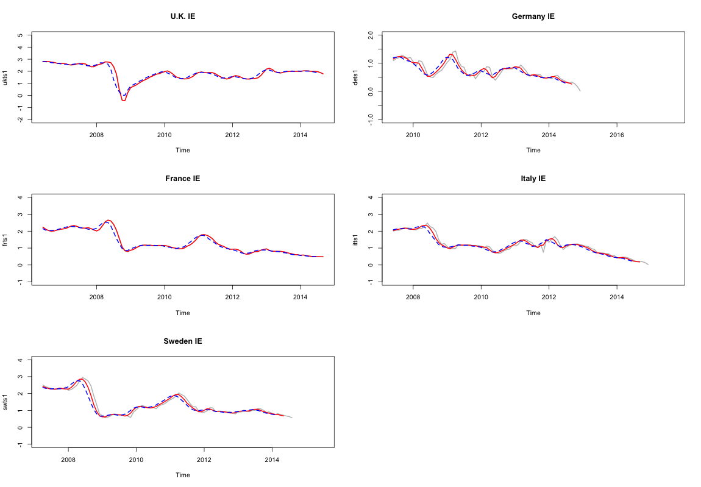
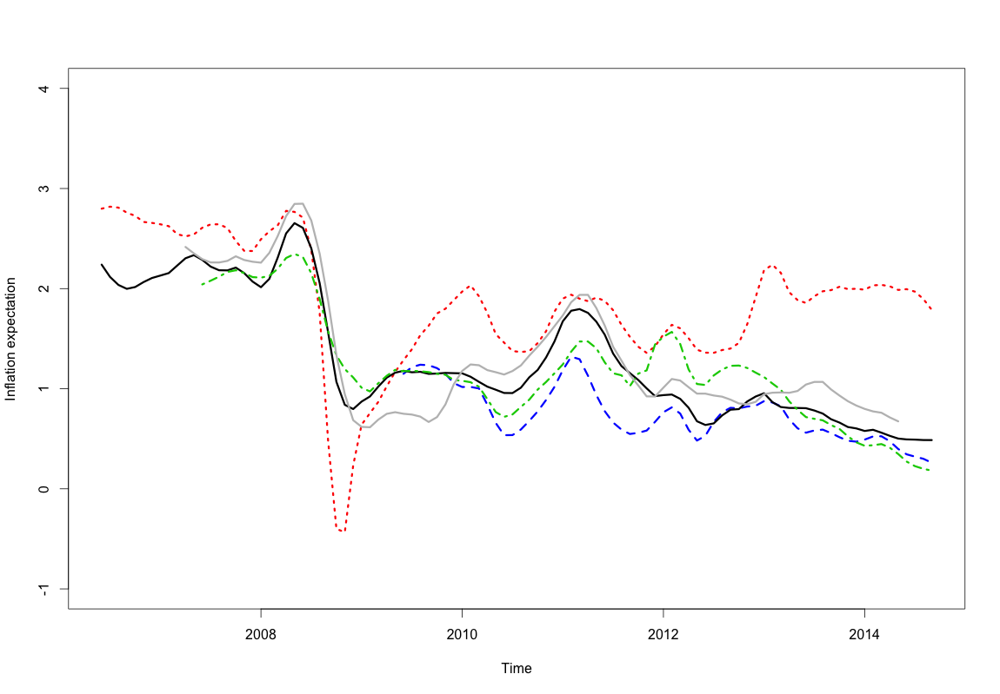

##  **MTS_expinf**


```yaml
Name of QuantLet : MTS_expinf

Published in : MTS

Description : 'Compares the estimated three-year and five-year forecast 
of IE for each European country. The inflation expectation (IE) is 
estimated by model-implied BEIR and plotted in gray.'

Keywords : 'bond, curve, estimation, graphical representation, plot, term structure, 
visualization'

See also : 'MTS_afns_de, MTS_afns_fr, MTS_afns_it, MTS_afns_sw, MTS_afns_uk, 
MTS_comexpinf_cds, MTS_comexpinf'

Author : Shi Chen

Submitted :

Datafile : 'IEdata.RData'

Example :
- 'The model-implied IE for each European country.'

```




```R
## clear history
rm(list = ls(all = TRUE))
graphics.off()

## load datafile
load("IEdata.RData")

## Plots
par(mfrow = c(3, 2), pty = "m")
ukts1 = ts(IEdata$uk.pi, frequency = 12, start = c(2006, 6))
ukts2 = ts(IEdata$uk.epi1, frequency = 12, start = c(2006, 6))
ukts3 = ts(IEdata$uk.epi2, frequency = 12, start = c(2006, 6))
plot(ukts1, ylim = c(-2, 5), col = "grey", main = "U.K. IE", lwd = 2)
lines(ukts2, col = "red", lwd = 2)
lines(ukts3, col = "blue", lty = 2, lwd = 2)
dets1 = ts(IEdata$de.pi, frequency = 12, start = c(2009, 6))
dets2 = ts(IEdata$de.epi1, frequency = 12, start = c(2009, 6))
dets3 = ts(IEdata$de.epi2, frequency = 12, start = c(2009, 6))
plot(dets1, col = "grey", ylim = c(-1, 2), main = "Germany IE", lwd = 2)
lines(dets2, col = "red", lwd = 2)
lines(dets3, col = "blue", lty = 2, lwd = 2)
frts1 = ts(IEdata$fr.pi, frequency = 12, start = c(2006, 6))
frts2 = ts(IEdata$fr.epi1, frequency = 12, start = c(2006, 6))
frts3 = ts(IEdata$fr.epi2, frequency = 12, start = c(2006, 6))
plot(frts1, col = "grey", ylim = c(-1, 4), main = "France IE", lwd = 2)
lines(frts2, col = "red", lwd = 2)
lines(frts3, col = "blue", lty = 2, lwd = 2)
itts1 = ts(IEdata$it.pi, frequency = 12, start = c(2007, 6))
itts2 = ts(IEdata$it.epi1, frequency = 12, start = c(2007, 6))
itts3 = ts(IEdata$it.epi2, frequency = 12, start = c(2007, 6))
plot(itts1, col = "grey", ylim = c(-1, 4), main = "Italy IE", lwd = 2)
lines(itts2, col = "red", lwd = 2)
lines(itts3, col = "blue", lty = 2, lwd = 2)
swts1 = ts(IEdata$sw.pi, frequency = 12, start = c(2007, 4))
swts2 = ts(IEdata$sw.epi1, frequency = 12, start = c(2007, 4))
swts3 = ts(IEdata$sw.epi2, frequency = 12, start = c(2007, 4))
plot(swts1, col = "grey", ylim = c(-1, 4), main = "Sweden IE", lwd = 2)
lines(swts2, col = "red", lwd = 2)
lines(swts3, col = "blue", lty = 2, lwd = 2)

## Plot: comparison
par(mfrow = c(1, 1), pty = "m")
plot(ukts2, lty = 3, lwd = 3, col = "red", ylim = c(-1, 4), ylab = "Inflation expectation")
lines(dets2, lty = 2, col = "blue", lwd = 3)
lines(frts2, lty = 1, col = "black", lwd = 3)
lines(itts2, lty = 4, col = "green3", lwd = 3)
lines(swts2, lty = 1, col = "grey", lwd = 3)
```
